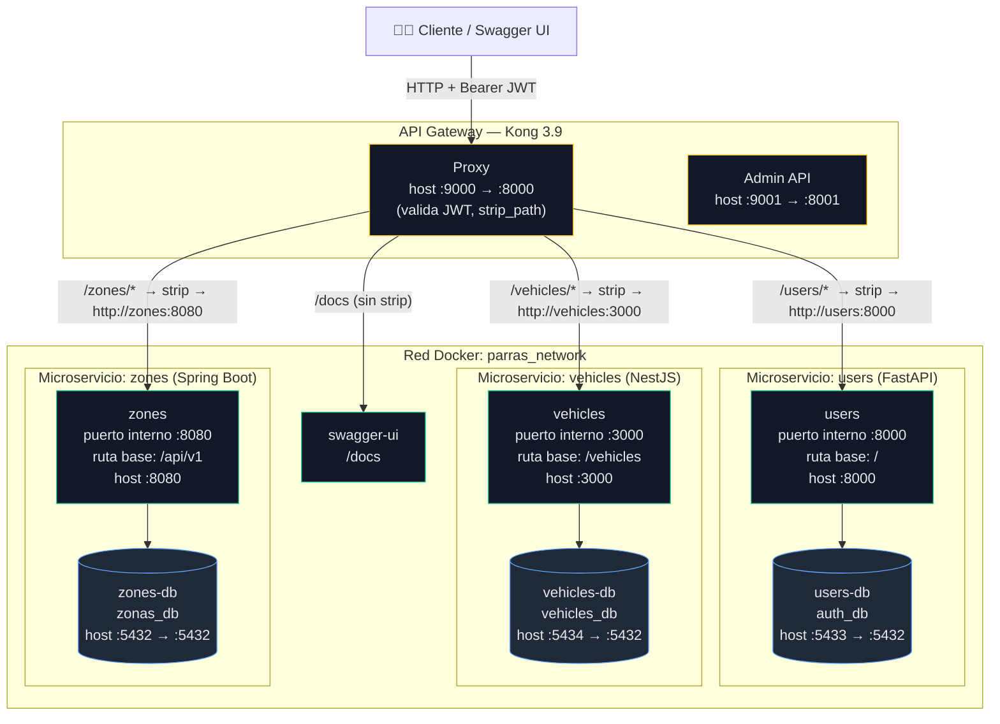

<p align="center">
  
</p>

<h1 align="center">Parras Car</h1>

<p align="center">
  Plataforma de gestión de estacionamiento basada en microservicios:
  <strong>usuarios</strong>, <strong>vehículos</strong> y <strong>zonas/lugares</strong>,
  expuestos detrás de un API Gateway con autenticación JWT.
</p>

---

## Tabla de contenidos

- [Arquitectura](#arquitectura)
- [Diagrama](#diagrama)
- [Microservicios](#microservicios)
- [API Gateway (Kong)](#api-gateway-kong)
- [Bases de datos](#bases-de-datos)
- [Cómo levantar el proyecto](#cómo-levantar-el-proyecto)
- [Puntos de entrada](#puntos-de-entrada)
- [Documentación de la API](#documentación-de-la-api)

---

## Arquitectura

El sistema sigue una arquitectura de **microservicios poliglota**. Cada servicio:

- Está escrito en un stack distinto (Python, TypeScript, Java).
- Tiene **su propia base de datos PostgreSQL** (patrón *database per service*) — no comparten esquema.
- Corre en su propio contenedor dentro de la red Docker `parras_network`.
- **No se expone directamente**: todo el tráfico entra por el **API Gateway (Kong)**, que valida JWT, recorta el prefijo de ruta y reenvía al servicio interno.

| Servicio | Stack | Lenguaje | Puerto interno | Ruta base interna | Base de datos |
|---|---|---|---|---|---|
| **users** | FastAPI | Python 3 | `8000` | `/` (routers: `persons`, `users`, `roles`) | `auth_db` |
| **vehicles** | NestJS 11 | TypeScript | `3000` | `/vehicles` (controller prefix) | `vehicles_db` |
| **zones** | Spring Boot (Java 21) | Java | `8080` | `/api/v1` | `zonas_db` |

---

## Diagrama



---

## Microservicios

### 1. `users` — FastAPI (Python)

Gestión de **personas, usuarios y roles**. Al crear una persona se genera su usuario y se asignan roles de forma atómica. El username se autogenera con las iniciales (`first_name[0] + middle_name[0] + last_name`).

- **Puerto interno:** `8000`
- **Ruta base interna:** `/` (routers `persons`, `users`, `roles`)
- **Acceso vía gateway:** `/users/*` (Kong recorta `/users`)
- **Base de datos:** `auth_db`
- **Migraciones:** Alembic (`alembic upgrade head` se ejecuta al arrancar el contenedor)
- **OpenAPI:** `/users/openapi.json`

### 2. `vehicles` — NestJS (TypeScript)

Registro de **vehículos** con tipos polimórficos: `car`, `motocicleta`, `pickupTruck`. Cada tipo valida campos propios en `datos`.

- **Puerto interno:** `3000`
- **Ruta base interna:** `/vehicles` (prefix del controller)
- **Acceso vía gateway:** `/vehicles/*` (Kong recorta `/vehicles`, así que la ruta efectiva del cliente es `/vehicles/vehicles`)
- **Base de datos:** `vehicles_db` (TypeORM)
- **OpenAPI:** `/vehicles/api-json`

### 3. `zones` — Spring Boot (Java 21)

Gestión de **zonas y lugares (places)** de estacionamiento, con filtros por estado y zona, y códigos de lugar autogenerados.

- **Puerto interno:** `8080`
- **Ruta base interna:** `/api/v1` (`/api/v1/zones`, `/api/v1/places`)
- **Acceso vía gateway:** `/zones/*` (Kong recorta `/zones`)
- **Base de datos:** `zonas_db` (Spring Data JPA)
- **OpenAPI:** `/zones/v3/api-docs`

---

## API Gateway (Kong)

Kong corre en modo **DB-less** (configuración declarativa en `gateway/kong.yml`).

| Puerto host | Puerto interno | Uso |
|---|---|---|
| `9000` | `8000` | **Proxy** — entrada de todas las peticiones |
| `9001` | `8001` | **Admin API** |

**Cómo enruta y expone cada servicio:**

| Prefijo en el gateway | Servicio destino | `strip_path` | JWT | Resultado |
|---|---|---|---|---|
| `/users/health` | `http://users:8000` | sí | ❌ | health check público |
| `/users/*` | `http://users:8000` | sí | ✅ | quita `/users` y reenvía |
| `/vehicles/*` | `http://vehicles:3000` | sí | ✅ | quita `/vehicles` y reenvía |
| `/zones/*` | `http://zones:8080` | sí | ✅ | quita `/zones` y reenvía |
| `/docs` | `http://swagger-ui:8080` | no | ❌ | Swagger UI |

- **Autenticación:** plugin `jwt` (algoritmo `HS256`) aplicado a las rutas de `/users`, `/vehicles` y `/zones`. Se requiere un token Bearer firmado con el secreto del consumer `parras-app` (`key: parras-app-key`).
- **`strip_path`**: Kong elimina el prefijo del servicio antes de reenviar, por eso el servicio interno nunca ve `/users`, `/vehicles` o `/zones`.

---

## Bases de datos

Cada microservicio tiene su **propia instancia PostgreSQL 16-alpine** (aislamiento total, *database per service*). Credenciales por defecto: `postgres / postgres`.

| Contenedor | Base de datos | Puerto host → interno | Usado por |
|---|---|---|---|
| `parras-users-db` | `auth_db` | `5433 → 5432` | users |
| `parras-vehicles-db` | `vehicles_db` | `5434 → 5432` | vehicles |
| `parras-zones-db` | `zonas_db` | `5432 → 5432` | zones |

Cada base persiste en su propio volumen Docker (`users_db_data`, `vehicles_db_data`, `zones_db_data`) y tiene healthcheck con `pg_isready`; los servicios esperan a que su DB esté saludable antes de arrancar.

---

## Cómo levantar el proyecto

Requisitos: **Docker** y **Docker Compose**.

```bash
# Levantar todo el stack (DBs + servicios + gateway + swagger)
docker compose up --build

# En segundo plano
docker compose up --build -d

# Ver estado de los servicios
docker compose ps

# Logs
docker compose logs -f kong

# Apagar (conservando datos)
docker compose down

# Apagar y borrar las bases de datos
docker compose down -v
```

---

## Puntos de entrada

| Punto de entrada | URL |
|---|---|
| **API Gateway (Kong)** | `http://localhost:9000` |
| **Swagger UI** | `http://localhost:9000/docs` |
| **Kong Admin** | `http://localhost:9001` |

> Todas las peticiones de negocio pasan por Kong. Los puertos directos de cada servicio (`8000`, `3000`, `8080`) quedan publicados para depuración, pero el flujo normal es a través del gateway con JWT.

### Health checks

| Servicio | URL (vía gateway) |
|---|---|
| Users | `GET /users/health` |
| Vehicles | `GET /vehicles/` |
| Zones | `GET /zones/api/v1/zones` |

---

## Documentación de la API

- **Swagger UI agregada:** `http://localhost:9000/docs` — usá el selector superior derecho para cambiar entre **Users**, **Vehicles** y **Zones**.
- **Guía detallada de endpoints, payloads, enums y validaciones:** ver [`API_GUIDE.md`](API_GUIDE.md).

| Servicio | Spec OpenAPI |
|---|---|
| Users | `/users/openapi.json` |
| Vehicles | `/vehicles/api-json` |
| Zones | `/zones/v3/api-docs` |
