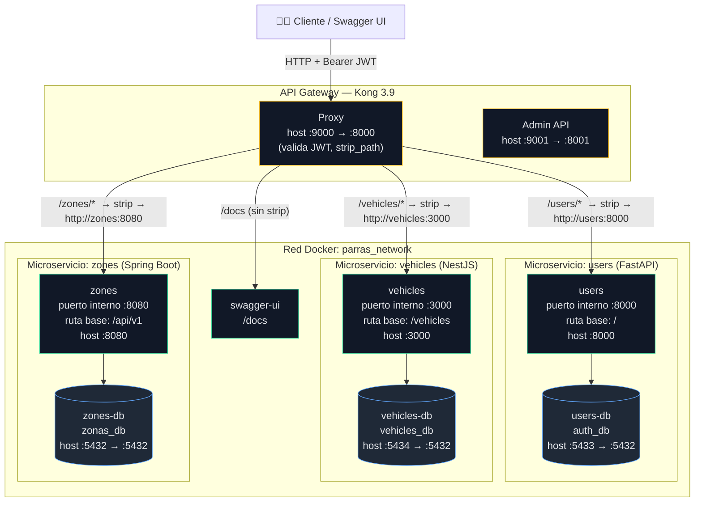

<p align="center">
  
</p>

<h1 align="center">Parras Car</h1>

<p align="center">
  Plataforma de gestión de estacionamiento basada en microservicios:
  <strong>usuarios</strong>, <strong>vehículos</strong> y <strong>zonas/lugares</strong>,
  expuestos detrás de un API Gateway con autenticación JWT.
</p>

---

## Tabla de contenidos

- [Arquitectura](#arquitectura)
- [Diagrama](#diagrama)
- [Microservicios](#microservicios)
- [API Gateway (Kong)](#api-gateway-kong)
- [Bases de datos](#bases-de-datos)
- [Cómo levantar el proyecto](#cómo-levantar-el-proyecto)
  - [Docker Compose (Desarrollo)](#-despliegue-en-docker-compose-desarrollo)
  - [Kubernetes (Producción)](#️-despliegue-en-kubernetes-producción)
- [Sistema de Autenticación y Permisos](#-sistema-de-autenticación-y-permisos)
- [Configuración de Variables de Entorno](#-configuración-de-variables-de-entorno)
- [Puntos de entrada](#puntos-de-entrada)
- [Tests y cobertura](#tests-y-cobertura)
- [Documentación de la API](#-documentación-de-la-api)
- [Troubleshooting](#-troubleshooting)
- [Monitoreo y Logs](#-monitoreo-y-logs)
- [Deploy a Producción](#-deploy-a-producción)

---

## Arquitectura

El sistema sigue una arquitectura de **microservicios poliglota**. Cada servicio:

- Está escrito en un stack distinto (Python, TypeScript, Java).
- Tiene **su propia base de datos PostgreSQL** (patrón *database per service*) — no comparten esquema.
- Corre en su propio contenedor dentro de la red Docker `parras_network`.
- **No se expone directamente**: todo el tráfico entra por el **API Gateway (Kong)**, que valida JWT, recorta el prefijo de ruta y reenvía al servicio interno.

| Servicio | Stack | Lenguaje | Puerto interno | Ruta base interna | Base de datos |
|---|---|---|---|---|---|
| **users** | FastAPI | Python 3 | `8000` | `/` (routers: `persons`, `users`, `roles`) | `auth_db` |
| **vehicles** | NestJS 11 | TypeScript | `3000` | `/vehicles` (controller prefix) | `vehicles_db` |
| **zones** | Spring Boot (Java 21) | Java | `8080` | `/api/v1` | `zonas_db` |

---

## Diagrama


```mermaid
flowchart TB
    Client["🧑‍💻 Cliente / Swagger UI"]

    subgraph Gateway["API Gateway — Kong 3.9"]
        direction TB
        Proxy["Proxy<br/>host :9000 → :8000<br/>(valida JWT, strip_path)"]
        Admin["Admin API<br/>host :9001 → :8001"]
    end

    Client -->|HTTP + Bearer JWT| Proxy

    subgraph Net["Red Docker: parras_network"]
        direction TB

        subgraph S1["Microservicio: users (FastAPI)"]
            U["users<br/>puerto interno :8000<br/>ruta base: /<br/>host :8000"]
            UDB[("users-db<br/>auth_db<br/>host :5433 → :5432")]
            U --> UDB
        end

        subgraph S2["Microservicio: vehicles (NestJS)"]
            V["vehicles<br/>puerto interno :3000<br/>ruta base: /vehicles<br/>host :3000"]
            VDB[("vehicles-db<br/>vehicles_db<br/>host :5434 → :5432")]
            V --> VDB
        end

        subgraph S3["Microservicio: zones (Spring Boot)"]
            Z["zones<br/>puerto interno :8080<br/>ruta base: /api/v1<br/>host :8080"]
            ZDB[("zones-db<br/>zonas_db<br/>host :5432 → :5432")]
            Z --> ZDB
        end

        SW["swagger-ui<br/>/docs"]
    end

    Proxy -->|"/users/*  → strip → http://users:8000"| U
    Proxy -->|"/vehicles/* → strip → http://vehicles:3000"| V
    Proxy -->|"/zones/*  → strip → http://zones:8080"| Z
    Proxy -->|"/docs (sin strip)"| SW

    classDef db fill:#1f2937,stroke:#60a5fa,color:#e5e7eb;
    classDef svc fill:#111827,stroke:#34d399,color:#e5e7eb;
    classDef gw fill:#111827,stroke:#fbbf24,color:#e5e7eb;
    class UDB,VDB,ZDB db;
    class U,V,Z,SW svc;
    class Proxy,Admin gw;
```

---

## Microservicios

### 1. `users` — FastAPI (Python)

Gestión de **personas, usuarios y roles**. Al crear una persona se genera su usuario y se asignan roles de forma atómica. El username se autogenera con las iniciales (`first_name[0] + middle_name[0] + last_name`).

- **Puerto interno:** `8000`
- **Ruta base interna:** `/` (routers `persons`, `users`, `roles`)
- **Acceso vía gateway:** `/users/*` (Kong recorta `/users`)
- **Base de datos:** `auth_db`
- **Migraciones:** Alembic (`alembic upgrade head` se ejecuta al arrancar el contenedor)
- **OpenAPI:** `/users/openapi.json`

### 2. `vehicles` — NestJS (TypeScript)

Registro de **vehículos** con tipos polimórficos: `car`, `motocicleta`, `pickupTruck`. Cada tipo valida campos propios en `datos`.

- **Puerto interno:** `3000`
- **Ruta base interna:** `/vehicles` (prefix del controller)
- **Acceso vía gateway:** `/vehicles/*` (Kong recorta `/vehicles`, así que la ruta efectiva del cliente es `/vehicles/vehicles`)
- **Base de datos:** `vehicles_db` (TypeORM)
- **OpenAPI:** `/vehicles/api-json`

### 3. `zones` — Spring Boot (Java 21)

Gestión de **zonas y lugares (places)** de estacionamiento, con filtros por estado y zona, y códigos de lugar autogenerados.

- **Puerto interno:** `8080`
- **Ruta base interna:** `/api/v1` (`/api/v1/zones`, `/api/v1/places`)
- **Acceso vía gateway:** `/zones/*` (Kong recorta `/zones`)
- **Base de datos:** `zonas_db` (Spring Data JPA)
- **OpenAPI:** `/zones/v3/api-docs`

---

## API Gateway (Kong)

Kong corre en modo **DB-less** (configuración declarativa en `gateway/kong.yml`).

| Puerto host | Puerto interno | Uso |
|---|---|---|
| `9000` | `8000` | **Proxy** — entrada de todas las peticiones |
| `9001` | `8001` | **Admin API** |

**Cómo enruta y expone cada servicio:**

| Prefijo en el gateway | Servicio destino | `strip_path` | JWT | Resultado |
|---|---|---|---|---|
| `/users/health` | `http://users:8000` | sí | ❌ | health check público |
| `/users/*` | `http://users:8000` | sí | ✅ | quita `/users` y reenvía |
| `/vehicles/*` | `http://vehicles:3000` | sí | ✅ | quita `/vehicles` y reenvía |
| `/zones/*` | `http://zones:8080` | sí | ✅ | quita `/zones` y reenvía |
| `/docs` | `http://swagger-ui:8080` | no | ❌ | Swagger UI |

- **Autenticación:** plugin `jwt` (algoritmo `HS256`) aplicado a las rutas de `/users`, `/vehicles` y `/zones`. Se requiere un token Bearer firmado con el secreto del consumer `parras-app` (`key: parras-app-key`).
- **`strip_path`**: Kong elimina el prefijo del servicio antes de reenviar, por eso el servicio interno nunca ve `/users`, `/vehicles` o `/zones`.

---

## Bases de datos

Cada microservicio tiene su **propia instancia PostgreSQL 16-alpine** (aislamiento total, *database per service*). Credenciales por defecto: `postgres / postgres`.

| Contenedor | Base de datos | Puerto host → interno | Usado por |
|---|---|---|---|
| `parras-users-db` | `auth_db` | `5433 → 5432` | users |
| `parras-vehicles-db` | `vehicles_db` | `5434 → 5432` | vehicles |
| `parras-zones-db` | `zonas_db` | `5432 → 5432` | zones |

Cada base persiste en su propio volumen Docker (`users_db_data`, `vehicles_db_data`, `zones_db_data`) y tiene healthcheck con `pg_isready`; los servicios esperan a que su DB esté saludable antes de arrancar.

---

## Cómo levantar el proyecto

### ⚡ Despliegue en Docker Compose (Desarrollo)

Requisitos: **Docker** y **Docker Compose**.

```bash
# Levantar todo el stack (DBs + servicios + gateway + swagger)
docker compose up --build

# En segundo plano
docker compose up --build -d

# Ver estado de los servicios
docker compose ps

# Logs en tiempo real
docker compose logs -f kong

# Apagar (conservando datos)
docker compose down

# Apagar y borrar las bases de datos
docker compose down -v
```

**Acceso después del deploy:**
- API Gateway: `http://localhost:9000`
- Swagger UI: `http://localhost:9000/docs`
- Kong Admin: `http://localhost:9001`

---

### ☸️ Despliegue en Kubernetes (Producción)

Requisitos:
- **Minikube** (para desarrollo local) o un cluster Kubernetes
- **kubectl** configurado
- **Docker** (para construir imágenes)

#### 1️⃣ Verificar que Minikube está corriendo

```bash
minikube status

# Si no está corriendo, iniciar:
minikube start
```

#### 2️⃣ Ejecutar el script de despliegue

```bash
./deploy-k8s.sh
```

Este script automatiza:
- ✅ Verifica que Minikube está activo
- ✅ Configura Docker para usar Minikube
- ✅ Reconstruye todas las imágenes Docker
- ✅ Aplica los manifiestos de Kubernetes en orden
- ✅ Muestra URLs de acceso

#### 3️⃣ Ver estado del despliegue

```bash
# Ver todos los pods
kubectl get pods -n yepez-sagnay-parra

# Ver servicios
kubectl get svc -n yepez-sagnay-parra

# Ver logs de un pod
kubectl logs -n yepez-sagnay-parra <pod-name> -f

# Ejemplo: logs del dashboard
kubectl logs -n yepez-sagnay-parra deployment/dashboard -f
```

#### 4️⃣ Acceso después del deploy

El script mostrará URLs como:
```
• Dashboard:     http://192.168.49.2:32000
• API Gateway:   http://192.168.49.2:30000
• Swagger UI:    http://192.168.49.2:9000/docs
```

#### 5️⃣ Redeploy (sin reconstruir imágenes)

Si solo cambias código YAML:

```bash
# Reiniciar un deployment
kubectl rollout restart deployment/dashboard -n yepez-sagnay-parra
kubectl rollout restart deployment/vehicles -n yepez-sagnay-parra
kubectl rollout restart deployment/tickets -n yepez-sagnay-parra

# Reimplementar un manifiesto
kubectl apply -f k8s/40-dashboard.yaml
```

#### 6️⃣ Acceso a las bases de datos (desde tu máquina)

```bash
# Port-forward a una base de datos (ej: users-db)
kubectl port-forward -n yepez-sagnay-parra svc/users-db 5432:5432

# Conectar con psql
psql -h localhost -U postgres -d auth_db
```

#### 7️⃣ Troubleshooting en Kubernetes

```bash
# Ver descripción detallada de un pod (errores al iniciar)
kubectl describe pod -n yepez-sagnay-parra <pod-name>

# Ver eventos del cluster
kubectl get events -n yepez-sagnay-parra --sort-by='.lastTimestamp'

# Ver recursos disponibles
kubectl top nodes
kubectl top pods -n yepez-sagnay-parra

# Borrar y redeplorar (limpia PVCs)
kubectl delete namespace yepez-sagnay-parra
./deploy-k8s.sh
```

#### 8️⃣ Estructura de manifiestos Kubernetes

```
k8s/
├── 00-namespace.yaml          # Crea namespace yepez-sagnay-parra
├── 01-secret.yaml             # Secrets (JWT_SECRET, DB passwords)
├── 02-configmap.yaml          # ConfigMaps (URLs, puertos)
├── 10-rabbitmq.yaml           # RabbitMQ (message broker)
├── 11-users-db.yaml           # PostgreSQL users
├── 12-vehicles-db.yaml        # PostgreSQL vehicles
├── 13-zones-db.yaml           # PostgreSQL zones
├── 14-assignments-db.yaml     # PostgreSQL assignments
├── 15-tickets-db.yaml         # PostgreSQL tickets
├── 16-audit-db.yaml           # PostgreSQL audit
├── 20-users.yaml              # Microservicio users (FastAPI)
├── 21-vehicles.yaml           # Microservicio vehicles (NestJS)
├── 22-zones.yaml              # Microservicio zones (Spring Boot)
├── 23-assignments.yaml        # Microservicio assignments (FastAPI)
├── 24-tickets.yaml            # Microservicio tickets (NestJS)
├── 25-ms-audit.yaml           # Microservicio audit (NestJS)
├── 30-kong-config.yaml        # Configuración de Kong
├── 31-kong.yaml               # Kong API Gateway
├── 40-dashboard.yaml          # Frontend React
└── 41-ingress.yaml            # Ingress (enrutamiento externo)
```

---

### 📋 Comparativa: Docker Compose vs Kubernetes

| Aspecto | Docker Compose | Kubernetes |
|--------|---|---|
| **Uso** | Desarrollo local | Producción, clusters |
| **Escalabilidad** | ❌ Manual | ✅ Automática (HPA) |
| **Alta disponibilidad** | ❌ No | ✅ Multi-réplicas, healthchecks |
| **Orquestación** | Docker Swarm (básico) | Kubernetes (robusto) |
| **Persistencia** | Volúmenes locales | PersistentVolumes (NFS, cloud) |
| **Comando** | `docker compose up` | `kubectl apply -f` + `deploy-k8s.sh` |

---

## 🔐 Sistema de Autenticación y Permisos

### Flujo de Autenticación

```
1. Frontend (Login)
   POST /auth/login {username, password}
   ↓
2. Backend (users service)
   ✓ Verifica contraseña
   ✓ Genera JWT (sin roles)
   ✓ Retorna {access_token, roles}
   ↓
3. Frontend (Almacenamiento)
   • localStorage.roles ← para UI (mostrar/ocultar botones)
   • Authorization header ← JWT para requests
   ↓
4. Cada request
   GET /vehicles
   Authorization: Bearer eyJ...
   ↓
5. Backend (Validación)
   JwtStrategy:
     • Decodifica JWT → obtiene userId
     • Consulta BD → obtiene roles reales
     • Retorna {userId, username, roles}
   ↓
6. RolesGuard
   • Lee @Roles('admin', 'root') en el endpoint
   • Valida: roles.includes('admin')?
   • 403 Forbidden si no tiene permisos
```

### Características de Seguridad

- ✅ **JWT sin roles**: El token solo contiene `{sub, username}`. Los roles NO se pueden modificar desde el cliente.
- ✅ **Roles en BD**: Cada request obtiene roles frescos del servidor. El cliente NO puede engañar al backend modificando localStorage.
- ✅ **Validación en 2 niveles**:
  - **JwtStrategy**: Decodifica JWT y obtiene roles de la BD
  - **RolesGuard**: Valida que el usuario tiene los roles requeridos para ese endpoint

### Tabla de Roles

| Rol | Permisos | Asignación |
|-----|----------|-----------|
| `cliente` | Ver sus vehículos asignados | Automático al registrarse |
| `admin` | CRUD completo de vehículos, zonas, usuarios | Manual en BD |
| `root` | Acceso total al sistema | Manual en BD |

### Asignación Automática de Roles

Al registrarse un nuevo usuario, automáticamente se le asigna el rol `cliente`:

```python
# users/app/services/person_service.py
if not user.roles:
    cliente_role = self.role_repo.findByName('cliente')
    user.roles = [cliente_role]
```

Para escalar a `admin` o `root`, modificar la BD manualmente:

```sql
-- Conectar a users-db
psql -h localhost -U postgres -d auth_db

-- Ver roles de un usuario
SELECT u.username, r.name FROM users u
  LEFT JOIN user_roles ur ON u.id = ur.user_id
  LEFT JOIN roles r ON ur.role_id = r.id;

-- Agregar rol root a un usuario
INSERT INTO user_roles (user_id, role_id)
  SELECT u.id, r.id FROM users u, roles r
  WHERE u.username = 'tadmin' AND r.name = 'root';

-- Remover rol cliente
DELETE FROM user_roles
  WHERE user_id = (SELECT id FROM users WHERE username = 'tadmin')
    AND role_id = (SELECT id FROM roles WHERE name = 'cliente');
```

---

## Puntos de entrada

| Punto de entrada | URL |
|---|---|
| **API Gateway (Kong)** | `http://localhost:9000` |
| **Swagger UI** | `http://localhost:9000/docs` |
| **Kong Admin** | `http://localhost:9001` |

> Todas las peticiones de negocio pasan por Kong. Los puertos directos de cada servicio (`8000`, `3000`, `8080`) quedan publicados para depuración, pero el flujo normal es a través del gateway con JWT.

### Health checks

| Servicio | URL (vía gateway) |
|---|---|
| Users | `GET /users/health` |
| Vehicles | `GET /vehicles/` |
| Zones | `GET /zones/api/v1/zones` |

---

## Tests y cobertura

Cada microservicio corre sus tests localmente (fuera de Docker), con **cobertura mínima requerida: 80%**.

| Servicio | Comando |
|---|---|
| `users` (FastAPI) | `cd users && JWT_SECRET=test-secret .venv/bin/python -m pytest --cov=app --cov-report=term-missing` |
| `assignments` (FastAPI) | `cd assignments && .venv/bin/python -m pytest --cov=app --cov-report=term-missing` |
| `vehicles` (NestJS) | `cd vehicles && pnpm run test:cov` |
| `tickets` (NestJS) | `cd tickets && pnpm run test:cov` |
| `ms-audit` (NestJS) | `cd ms-audit && pnpm run test:cov` |
| `zones` (Spring Boot) | `cd zones && ./mvnw verify` (reporte en `target/site/jacoco/index.html`) |

Los servicios Python necesitan un venv local (no se crea con Docker):

```bash
cd <servicio>       # users o assignments
python3.12 -m venv .venv
.venv/bin/pip install -r requirements.txt pytest-cov
```

> `gateway` es solo configuración de Kong, sin código propio — no aplica.

---

---

## 🔧 Configuración de Variables de Entorno

### Docker Compose (`.env`)

Crear archivo `.env` en la raíz del proyecto:

```env
# Base de datos
DB_USER=postgres
DB_PASSWORD=postgres

# JWT
JWT_SECRET=tu-secreto-super-seguro-aqui
JWT_ISSUER=parras-car
JWT_EXPIRE_MINUTES=60

# URLs de servicios (internas, dentro de Docker)
USERS_SERVICE_URL=http://users:8000
VEHICLES_SERVICE_URL=http://vehicles:3000
ZONES_SERVICE_URL=http://zones:8080
ASSIGNMENTS_SERVICE_URL=http://assignments:8001
TICKETS_SERVICE_URL=http://tickets:3001
AUDIT_SERVICE_URL=http://ms-audit:3002

# RabbitMQ
RABBITMQ_USER=guest
RABBITMQ_PASSWORD=guest
RABBITMQ_HOST=rabbitmq
RABBITMQ_PORT=5672
```

### Kubernetes (secrets en manifiestos)

Los secrets se definen en `k8s/01-secret.yaml`:

```yaml
apiVersion: v1
kind: Secret
metadata:
  name: app-secrets
  namespace: yepez-sagnay-parra
type: Opaque
stringData:
  JWT_SECRET: tu-secreto-super-seguro-aqui
  DB_PASSWORD: postgres-secure-password
  RABBITMQ_PASSWORD: guest
```

> ⚠️ **Producción**: Usar un gestor de secrets como HashiCorp Vault o AWS Secrets Manager, no valores hardcodeados.

---

## 📚 Documentación de la API

- **Swagger UI:** `http://localhost:9000/docs` (Docker) o URL del Ingress (Kubernetes)
  - Usa el selector superior derecho para cambiar entre **Users**, **Vehicles**, **Zones**, etc.
- **Guía detallada de endpoints, payloads, enums y validaciones:** ver [`API_GUIDE.md`](API_GUIDE.md)

| Servicio | Spec OpenAPI |
|---|---|
| Users | `/users/openapi.json` |
| Vehicles | `/vehicles/api-json` |
| Zones | `/zones/v3/api-docs` |
| Assignments | `/assignments/openapi.json` |
| Tickets | `/tickets/api-json` |
| Audit | `/ms-audit/api-json` |

---

## 🐛 Troubleshooting

### Docker Compose

**Problema: "Connection refused" al conectar a la BD**
```bash
# Esperar a que la BD esté lista
docker compose logs users-db
docker compose restart users

# O usar healthcheck
docker compose ps  # Ver estado HEALTH
```

**Problema: Puerto ya en uso**
```bash
# Cambiar puertos en docker-compose.yml
# O liberar el puerto:
lsof -i :9000          # Ver qué usa puerto 9000
kill -9 <PID>          # Matar proceso
```

**Problema: Cambios en código no se reflejan**
```bash
# Reconstruir sin cache
docker compose up --build --force-recreate
```

### Kubernetes

**Problema: Pod en CrashLoopBackOff**
```bash
# Ver logs detallados
kubectl logs -n yepez-sagnay-parra <pod-name>

# Ver descripción del pod
kubectl describe pod -n yepez-sagnay-parra <pod-name>

# Ver eventos del namespace
kubectl get events -n yepez-sagnay-parra
```

**Problema: BD no se conecta desde microservicio**
```bash
# Verificar que la BD está corriendo
kubectl get pods -n yepez-sagnay-parra | grep db

# Conectar a la BD directamente
kubectl exec -it -n yepez-sagnay-parra users-db-0 -- psql -U postgres -d auth_db

# Ver logs de la BD
kubectl logs -n yepez-sagnay-parra users-db-0
```

**Problema: JWT validation fallido**
```bash
# Verificar que JWT_SECRET es igual en Kong y users service
kubectl get secret -n yepez-sagnay-parra app-secrets -o yaml

# Decodificar JWT (en terminal):
# echo <jwt> | cut -d. -f2 | base64 -d | jq
```

**Problema: Minikube no inicia**
```bash
# Resetear Minikube completamente
minikube delete
minikube start

# Aumentar memoria/CPU si es necesario
minikube start --cpus=4 --memory=8192
```

---

## 📊 Monitoreo y Logs

### Docker Compose

```bash
# Logs de todos los servicios
docker compose logs -f

# Logs de un servicio específico
docker compose logs -f vehicles

# Últimas N líneas
docker compose logs --tail=50 users
```

### Kubernetes

```bash
# Logs de un deployment (últimas líneas)
kubectl logs -n yepez-sagnay-parra deployment/vehicles --tail=50

# Logs en tiempo real
kubectl logs -n yepez-sagnay-parra deployment/vehicles -f

# Logs de un pod específico
kubectl logs -n yepez-sagnay-parra vehicles-abc123-xyz -f

# Logs de todos los pods de un label
kubectl logs -n yepez-sagnay-parra -l app=vehicles -f
```

---

## 🚀 Deploy a Producción

### Pasos previos

1. **Cambiar imágenes Docker**: Usar un registry (Docker Hub, ECR, GCR)
   ```yaml
   # k8s/21-vehicles.yaml
   image: tu-registry.io/yepez-sagnay-parra-vehicles:latest
   ```

2. **Usar secrets reales**: No hardcodear en manifiestos
   ```bash
   kubectl create secret generic app-secrets \
     --from-literal=JWT_SECRET=$(openssl rand -base64 32) \
     -n yepez-sagnay-parra
   ```

3. **Configurar certificados TLS**: Agregar cert-manager
   ```yaml
   # k8s/41-ingress.yaml
   tls:
     - hosts:
         - parras-car.ejemplo.com
       secretName: tls-cert
   ```

4. **Persistent Volumes**: Usar un storage class persistente
   ```yaml
   storageClassName: fast-ssd  # O tu provider default
   ```

5. **Escalado**: Configurar HPA (Horizontal Pod Autoscaler)
   ```yaml
   apiVersion: autoscaling/v2
   kind: HorizontalPodAutoscaler
   metadata:
     name: vehicles-hpa
   spec:
     scaleTargetRef:
       apiVersion: apps/v1
       kind: Deployment
       name: vehicles
     minReplicas: 2
     maxReplicas: 10
     metrics:
     - type: Resource
       resource:
         name: cpu
         target:
           type: Utilization
           averageUtilization: 70
   ```

---

## 📝 Checklist de Deployment

- [ ] Todas las imágenes Docker están en un registry
- [ ] JWT_SECRET es diferente en desarrollo y producción
- [ ] Passwords de BD están en secrets, no en código
- [ ] Certificados TLS configurados
- [ ] Logs centralizados (ELK, Datadog, etc.)
- [ ] Backups de BD configurados
- [ ] Monitoreo y alertas activas
- [ ] Rollback plan documentado
